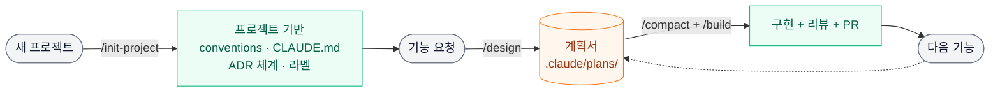
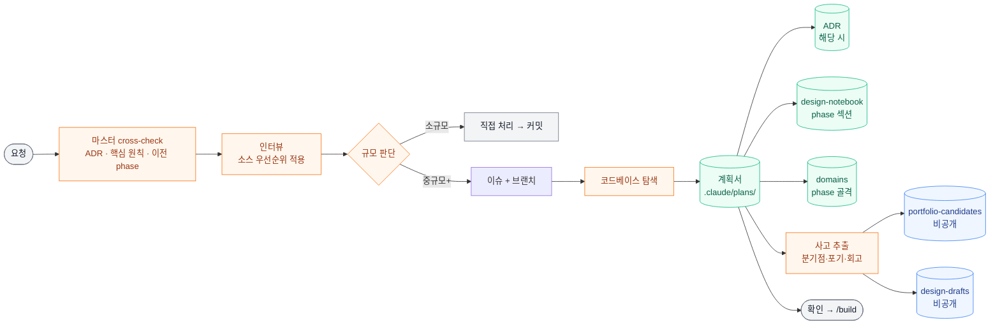
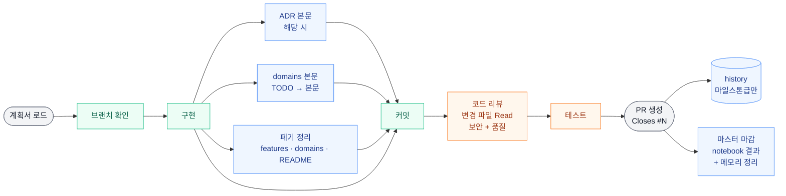

# 스킬 흐름 시각화 — `/design` · `/build` · `/init-project`

Claude Code 기반 개인 작업에서 가장 자주 쓰는 세 스킬의 단계 흐름을 다이어그램으로 정리한 문서. 각 스킬이 무엇을 입력으로 받아 어떤 산출물을 남기는지 한눈에 보기 위해 만들었다.

세 스킬의 상세 단계 정의는 글로벌 스킬 파일에 있다:

- `/design` → `~/.claude/skills/design/SKILL.md`
- `/build` → `~/.claude/skills/build/SKILL.md`
- `/init-project` → `~/.claude/commands/init-project.md`

설계 사상(왜 이렇게 나눴는지, 5문서 아키텍처, progressive disclosure)은 [design-build-skills.md](design-build-skills.md)에 따로 정리.

## 세 스킬의 관계

새 프로젝트는 `/init-project`로 기반(컨벤션·라벨·ADR 체계 등)을 깔고, 그 위에서 기능 단위 작업은 `/design`이 계획서를 만들고 `/build`가 구현·리뷰·PR까지 끌고 간다.

## /design

요청을 받아 인터뷰 → 계획서 작성 → 사고 흐름 추출까지. 핵심은 **계획서 하나만 떨어뜨리지 않는다**는 점 — 마스터 단위 서사(design-notebook), 되돌리기 어려운 결정(ADR), 도메인 명세 골격(domains/), 비공개 회고(drafts), 포폴 어필 후보(portfolio-candidates)를 각자의 owner와 수명에 맞춰 동시에 갱신한다.

**핵심 분기점**

- *규모 판단* — 소규모(파일 1\~2개)는 직접 처리하고 커밋. 중규모+는 이슈+브랜치 경유.
- *마스터 cross-check* — 마스터 phase 진입이면 ADR / 핵심 원칙 / 이전 결정을 먼저 점검. 이걸 빼면 핵심 원칙과 충돌하는 안을 무의식적으로 제안하는 사고가 난다 (2026-05-16 인터뷰에서 실제 발생).
- *사고 추출* — 의사결정 분기점·포기한 안·회고를 추출해 design-notebook(공개)에 통합. 감정·솔직 회고는 design-drafts(비공개)로.

## /build

계획서를 로드해 구현 → 코드 리뷰 → 테스트 → PR. 구현 단계가 단순한 "코드만 짜기"가 아니라 **ADR 본문 채우기 · 도메인 문서 본문 채우기 · 폐기 처리 시 카탈로그 정리**까지 같이 묶이는 게 핵심. 코드만 머지되고 문서가 비어 있으면 다음 phase에서 같은 작업이 반복된다 (2026-05-17 인사이트 v2 Phase 3 사례).

**핵심 분기점**

- *코드 리뷰* — 체크리스트 나열이 아니라 **변경된 모든 파일을 Read로 다시 읽은 뒤** 보안+품질 점검. 강제하지 않으면 리뷰가 형식이 된다.
- *폐기 처리* — 기능 제거 PR에서 폐기 키워드 grep을 한 번 돌려 features.md · domains · README에 잔존 흔적이 없는지 점검 (2026-05-17 dev-report 폐기에서 features.md 잔존 발견 사례).
- *마스터 마감* — 마스터 이슈의 마지막 phase이거나 마스터 close 시 design-notebook 결과 섹션 + 마스터 단위 메모리 정리까지 한 사이클로.

## /init-project

새 프로젝트 한 번만 쓰는 스킬. 인터뷰 → 컨벤션 → 브랜치 전략 → 라벨 → CLAUDE.md → history → ADR 체계 → Docker → 초기 이슈 순서로 한 번에 깐다. `/design`·`/build`가 돌아갈 수 있는 기반을 만드는 단계.

**핵심 산출물**

- `docs/conventions.md` — 네이밍·커밋·보안·테스트 원칙 + 리팩토링 기준
- `CLAUDE.md` — Claude 작업 규칙 (커밋 단위, 보안, 테스트 등)
- `docs/adr/` — ADR 체계 (README + template + 0001 초기 판단)
- GitHub 라벨 + default branch 설정 — 이후 `/design`이 만드는 이슈/PR이 일관성을 가짐

## 색상 범례

| 색 | 의미 |
|----|------|
| 회색 | 입력/출력 (사용자 요청, 완료 지점) |
| 주황 | 의사결정·판단·인터뷰 단계 |
| 초록 | 공개 산출물 (코드, 이슈, ADR, design-notebook, domains, features 등) |
| 파랑 | 비공개 산출물 (portfolio-candidates, design-drafts) |
| 빨강 | 외부 시스템 연동 (GitHub, Docker 등) |
