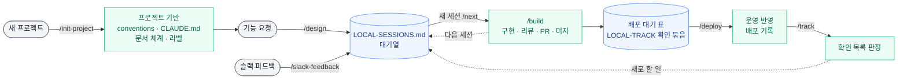
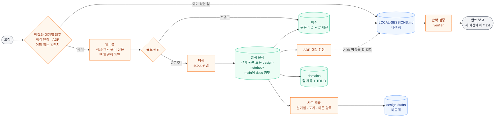
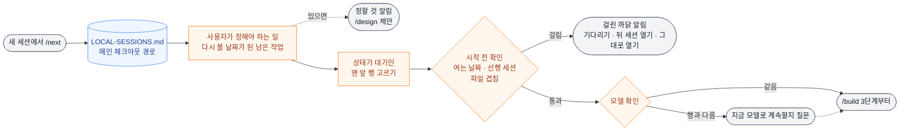
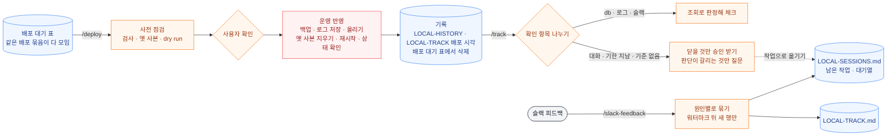

# 스킬 흐름 시각화 — `/init-project`부터 `/track`까지

Claude Code 기반 개인 작업에서 기능 하나를 기획하고 구현하고 배포한 뒤 확인하기까지 쓰는 스킬의 단계 흐름을 다이어그램으로 정리한 문서. 각 스킬이 무엇을 입력으로 받아 어떤 산출물을 남기는지 한눈에 보기 위해 만들었다.

스킬의 원본은 이 repo의 [`plugin/skills/`](../plugin/)에 있고, `~/.claude/skills/`는 그 심링크다 (bare 이름 유지 + git 버전 관리). 원본 파일은 `plugin/skills/<이름>/SKILL.md`다.

| 스킬 | 하는 일 |
|------|---------|
| `/init-project` | 새 프로젝트의 컨벤션, 문서 체계, 대기열 파일 자리, GitHub 설정을 한 번 만든다 |
| `/design` | 인터뷰, 설계 문서, 이슈를 거쳐 일을 세션으로 나누고 대기열 파일 `LOCAL-SESSIONS.md`에 행을 넣는다 |
| `/next` | 대기열 맨 앞 세션을 열 수 있는지 확인하고 `/build`로 넘긴다 |
| `/build` | 세션 하나를 worktree에서 구현하고 리뷰, PR, 머지, 마무리까지 한다 |
| `/deploy` | 머지된 변경을 운영에 올리고 배포 기록과 배포 대기 표를 고친다 |
| `/track` | 배포 뒤 확인 목록 `LOCAL-TRACK.md`의 항목을 판정한다 |
| `/slack-feedback` | 슬랙에 달린 피드백을 원인별로 묶어 대기열과 확인 목록에 합친다 |

`review-code`는 `/build` 5단계가 부르고 `writing`과 `orchestrate`는 필요할 때 따로 부르는 도구라서, 이 문서에는 흐름을 그리지 않았다.

왜 이렇게 나눴는지, 문서 구조와 owner, progressive disclosure는 [design-build-skills.md](design-build-skills.md)에 있고, 로드 시점과 훅까지 포함한 전체 구성은 [system-map.md](system-map.md)에 있다.

## 스킬의 관계

새 프로젝트는 `/init-project`로 기반을 만든다. 기능 단위 작업은 `/design`이 대기열에 세션 행을 넣고, 새 세션에서 `/next`나 `/build <세션>`으로 행을 하나씩 열어 구현한다. 머지한 세션은 배포 대기 표에 들어가고, 같은 배포 묶음이 다 모이면 `/deploy`로 운영에 올린다. `/track`이 배포 뒤 확인 목록을 판정하고, 여기서 나온 새 일과 `/slack-feedback`이 묶은 피드백은 다시 대기열로 간다.

```mermaid
graph LR
    NP(["새 프로젝트"]) -->|/init-project| IP["프로젝트 기반<br/>conventions · CLAUDE.md<br/>문서 체계 · 라벨"]
    IP --> RQ(["기능 요청"])
    RQ -->|/design| QU[("LOCAL-SESSIONS.md<br/>대기열")]
    QU -->|새 세션 /next| BD["/build<br/>구현 · 리뷰 · PR · 머지"]
    BD --> DW[("배포 대기 표<br/>LOCAL-TRACK 확인 묶음")]
    BD -.다음 세션.-> QU
    DW -->|/deploy| DP["운영 반영<br/>배포 기록"]
    DP -->|/track| TR["확인 목록 판정"]
    TR -.새로 할 일.-> QU
    FB(["슬랙 피드백"]) -->|/slack-feedback| QU

    classDef io fill:#f3f4f6,stroke:#6b7280,color:#111827
    classDef skill fill:#ecfdf5,stroke:#10b981,color:#065f46
    classDef local fill:#eff6ff,stroke:#3b82f6,color:#1e3a8a

    class NP,RQ,FB io
    class IP,BD,DP,TR skill
    class QU,DW local
```

## /design

요청을 받아 대기열 대조 → 인터뷰 → 설계 문서 → 이슈 → 세션 나누기까지 하고, 구현은 `/build`에 넘긴다. 핵심은 **사고는 설계 문서에 남기고, 진행 상태는 대기열 행에 두는 것**이다. 설계 문서에는 분기점과 포기한 안까지 적고, ADR은 대상인지만 판단해 구현 세션의 할 일에 적는다.

```mermaid
graph LR
    Q(["요청"]) --> CX{"맥락과 대기열 대조<br/>핵심 원칙 · ADR<br/>이미 있는 일인지"}
    CX -->|이미 있는 일| QU
    CX -->|새 일| I["인터뷰<br/>핵심·맥락 묶어 질문<br/>뼈대 결정 확인"]
    I --> S{"규모 판단"}
    S -->|소규모| IS
    S -->|중규모+| EX["탐색<br/>scout 위임"]
    EX --> DOC[("설계 문서<br/>설계 원본 또는 design-notebook<br/>main에 docs 커밋")]
    DOC --> TE["사고 추출<br/>분기점 · 포기 · 미룬 항목"]
    DOC --> ADJ["ADR 대상 판단"]
    DOC --> DOM[("domains<br/>절 제목 + TODO")]
    TE --> DD[("design-drafts<br/>비공개")]
    DOC --> IS[("이슈<br/>묶음 이슈 + 앞 세션")]
    IS --> QU[("LOCAL-SESSIONS.md<br/>세션 행")]
    ADJ -.ADR 작성을 할 일로.-> QU
    QU --> V["반박 검증<br/>verifier"]
    V --> CF(["완료 보고<br/>새 세션에서 /next"])

    classDef io fill:#f3f4f6,stroke:#6b7280,color:#111827
    classDef judge fill:#fff7ed,stroke:#f97316,color:#9a3412
    classDef public fill:#ecfdf5,stroke:#10b981,color:#065f46
    classDef private fill:#eff6ff,stroke:#3b82f6,color:#1e3a8a

    class Q,CF io
    class CX,I,S,EX,TE,ADJ,V judge
    class DOC,DOM,IS public
    class DD,QU private
```

**핵심 분기점**

- *대기열 대조*: 요청을 대기열의 할 일, 손댈 파일, 이슈와 비교해 이미 있는 일, 일부 겹치는 일, 새 일, 진행 중인 세션과 겹치는 일 가운데 하나로 정한다. 이미 있는 일이면 새 세션을 만들지 않고 그 행에 세부만 덧붙인다. 설계 문서의 핵심 원칙이나 Accepted ADR과 충돌하는 안은 제안하지 않고 충돌했다는 사실을 알린다. 2026-05-16 인터뷰에서 핵심 원칙과 충돌하는 안을 제안한 일이 있어서 이 확인을 흐름 맨 앞에 둔다.
- *인터뷰 체크포인트*: 질문은 핵심과 맥락을 묶어 한 번에 하고, 설계의 뼈대가 되는 결정만 개념과 흐름으로 정리해 확인받은 뒤 세부는 AI가 정한다.
- *규모 판단*: 소규모면 탐색과 설계 문서를 건너뛰고 이슈 하나와 대기열 행 하나만 만든다. 소규모라도 구현은 `/build`가 한다.
- *세션 나누기*: 기본은 세션 하나다. 따로 배포해야 하는 변경이 섞였을 때, 사람의 확인이나 데이터가 쌓이기를 기다려야 다음 일을 정할 수 있을 때, 한 세션의 맥락에 담기 어려울 만큼 클 때만 나눈다. 세션 하나는 이슈 1개, 브랜치 1개, PR 1개다.
- *사고 추출*: 분기점, 포기한 안, 미룬 항목, 자신 없는 부분, 비자명한 제약을 설계 문서에 넣는다. 비공개로 분류한 항목은 design-drafts 폴더가 있는 프로젝트에서만 그곳에 적는다.

## /next

대기열 맨 앞 세션을 새 세션에서 여는 스킬이다. 기획은 `/design` 세션이 끝내 두므로, 구현 세션은 대기열 행과 이슈, 설계 문서의 해당 절을 읽고 바로 시작한다.

```mermaid
graph LR
    Q(["새 세션에서 /next"]) --> RD[("LOCAL-SESSIONS.md<br/>메인 체크아웃 경로")]
    RD --> DU["사용자가 정해야 하는 일<br/>다시 볼 날짜가 된 남은 작업"]
    DU -.있으면.-> DS(["정할 것 알림<br/>/design 제안"])
    DU --> PK["상태가 대기인<br/>맨 앞 행 고르기"]
    PK --> CK{"시작 전 확인<br/>여는 날짜 · 선행 세션<br/>파일 겹침"}
    CK -->|걸림| ASK(["걸린 까닭 알림<br/>기다리기 · 뒤 세션 열기 · 그대로 열기"])
    CK -->|통과| MD{"모델 확인"}
    MD -->|행과 다름| ASK2(["지금 모델로 계속할지 질문"])
    MD -->|같음| BD(["/build 3단계부터"])
    ASK2 -.-> BD

    classDef io fill:#f3f4f6,stroke:#6b7280,color:#111827
    classDef judge fill:#fff7ed,stroke:#f97316,color:#9a3412
    classDef private fill:#eff6ff,stroke:#3b82f6,color:#1e3a8a

    class Q,ASK,ASK2,BD,DS io
    class DU,PK,CK,MD judge
    class RD private
```

## /build

세션 하나는 이슈 1개, 브랜치 1개, PR 1개다. 대기열 행을 읽어 worktree에서 구현하고, 리뷰와 PR과 머지를 거쳐 대기열과 배포 뒤 확인 목록까지 고친다. 구현 단계에서 **ADR, 도메인 문서 본문, features 카탈로그, 없앤 기능의 흔적 정리**까지 같은 PR에 넣는 게 핵심이다. 코드만 머지되고 문서가 비어 있으면 다음 phase에서 같은 작업이 반복된다 (2026-05-17 인사이트 v2 Phase 3 사례).

```mermaid
graph LR
    IN(["세션 이름 · 이슈 번호<br/>또는 /next에서"]) --> CX["맥락<br/>CLAUDE.md · 설계 문서 절"]
    CX --> CK{"시작 전 확인<br/>/next에서 왔으면 생략"}
    CK --> WT["이름 붙인 worktree<br/>LOCAL 파일 링크<br/>행 상태 진행 중"]
    WT --> IMP["구현<br/>독립 단위 worker 병렬<br/>정적 검사 · 테스트"]
    IMP --> DOCU[("커밋되는 문서<br/>ADR · domains · features<br/>history · design-notebook")]
    DOCU --> R["리뷰<br/>opus: /review-code<br/>sonnet: opus 서브에이전트"]
    R --> PR["PR 생성 → CI 확인<br/>gh pr checks --watch"]
    PR --> MG{"머지 전 확인 칸"}
    MG -->|차 있음| STOP(["PR에서 멈춤<br/>사람 확인 뒤 /build 세션"])
    MG -->|비어 있음| M["머지"]
    STOP -.-> M
    M --> WU[("마무리<br/>worktree 정리<br/>배포 대기 표 · LOCAL-TRACK 묶음")]
    WU --> NX(["다음 세션 안내<br/>/next 또는 /deploy"])

    classDef io fill:#f3f4f6,stroke:#6b7280,color:#111827
    classDef code fill:#ecfdf5,stroke:#10b981,color:#065f46
    classDef check fill:#fff7ed,stroke:#f97316,color:#9a3412
    classDef local fill:#eff6ff,stroke:#3b82f6,color:#1e3a8a
    classDef external fill:#fef2f2,stroke:#ef4444,color:#991b1b

    class IN,STOP,NX io
    class WT,IMP,DOCU,M code
    class CX,CK,R,MG check
    class WU local
    class PR external
```

**핵심 분기점**

- *시작 전 확인*: 여는 날짜, 선행 세션, 파일 겹침, 모델을 본다. 파일 겹침은 열린 PR의 파일과 다른 worktree에서 고치고 있는 파일을 함께 본다. 모델이 행과 다르면 멈추고 지금 모델로 계속할지 묻는다.
- *worktree*: 커밋하는 세션은 `.claude/worktrees/` 아래 이름 붙인 worktree에서 하고, 메인 체크아웃은 base 브랜치에 둔 채 기획, 배포, 확인처럼 커밋하지 않는 일에 쓴다. 커밋하지 않는 LOCAL 파일은 worktree 안에서도 메인 체크아웃의 원본을 절대 경로로 읽고 고친다.
- *커밋되는 문서*: worktree 세션은 base 브랜치를 체크아웃할 수 없어서, ADR, domains 본문, features, project-history, 설계 노트를 머지 전에 PR 브랜치에 넣는다. 기능을 없앤 PR은 없앤 이름으로 features, domains, README를 grep해 남은 흔적을 지운다.
- *리뷰*: opus 세션은 `/review-code`를 부르고, sonnet 세션은 opus 서브에이전트에 같은 절차로 리뷰를 맡긴다. 보안 감사는 바뀐 파일을 다시 읽으며 세션이 항상 직접 하고, 리뷰에서 나온 것은 같은 브랜치에서 고치거나 안 고친 까닭을 PR 본문에 적는다.
- *CI 확인과 머지*: `gh pr checks --watch`로 CI 통과를 확인한 뒤에 머지한다. 머지 전 확인 칸이 차 있으면 PR에서 멈추고, 사람이 확인을 마친 뒤 `/build <세션>`을 다시 부르면 CI 확인부터 이어서 머지한다.
- *마무리*: worktree와 브랜치를 지우고, 대기열 행을 배포 대기 표로 옮기고, 행의 배포 뒤 확인 칸이 차 있거나 세션 중에 운영에서 볼 것이 생겼으면 `LOCAL-TRACK.md`에 묶음을 만든다. 같은 배포 묶음의 세션이 모두 배포 대기 표에 있으면 `/deploy` 차례라고 알린다.

## /deploy · /track · /slack-feedback

머지 뒤의 일은 스킬 3개가 나눠 맡는다. `/deploy`는 배포 대기 표를 비우고, `/track`은 배포 뒤 확인 목록을 판정하고, `/slack-feedback`은 운영에서 들어온 피드백을 대기열로 가져온다.

```mermaid
graph LR
    DW[("배포 대기 표<br/>같은 배포 묶음이 다 모임")] -->|/deploy| PRE["사전 점검<br/>검사 · 옛 사본 · dry run"]
    PRE --> OK{"사용자 확인"}
    OK --> RUN["운영 반영<br/>백업 · 로그 저장 · 올리기<br/>옛 사본 지우기 · 재시작 · 상태 확인"]
    RUN --> REC[("기록<br/>LOCAL-HISTORY · LOCAL-TRACK 배포 시각<br/>배포 대기 표에서 삭제")]
    REC -->|/track| TR{"확인 항목 나누기"}
    TR -->|db · 로그 · 슬랙| AUTO["조회로 판정해 체크"]
    TR -->|대화 · 기한 지남 · 기준 없음| ASK["닫을 것만 승인 받기<br/>판단이 갈리는 것만 질문"]
    ASK -.작업으로 옮기기.-> QU[("LOCAL-SESSIONS.md<br/>남은 작업 · 대기열")]
    SL(["슬랙 피드백"]) -->|/slack-feedback| FB["원인별로 묶기<br/>워터마크 뒤 새 행만"]
    FB --> QU
    FB --> TK[("LOCAL-TRACK.md")]

    classDef io fill:#f3f4f6,stroke:#6b7280,color:#111827
    classDef judge fill:#fff7ed,stroke:#f97316,color:#9a3412
    classDef local fill:#eff6ff,stroke:#3b82f6,color:#1e3a8a
    classDef external fill:#fef2f2,stroke:#ef4444,color:#991b1b

    class SL io
    class PRE,OK,TR,AUTO,ASK,FB judge
    class DW,REC,QU,TK local
    class RUN external
```

**핵심 분기점**

- */deploy 배포 단위*: 운영에서만 보이는 확인 항목이 2~3개 모이면 올린다. 스키마나 외부 발송 경로를 바꾸는 세션은 그 세션만 올린다. 서버 주소와 명령은 프로젝트 LOCAL 파일의 배포 절에서 읽고, 공개 문서에는 적지 않는다.
- */deploy 사용자 확인*: 운영 서버에 명령을 보내기 직전에 앞 배포 커밋, 올릴 커밋, 함께 올리는 PR, 지울 옛 사본을 보여 주고 한 번 묻는다.
- */track 판정*: 항목마다 적힌 확인 방법과 닫는 기준으로 판정한다. 조회로 판정할 수 있는 항목은 직접 닫고, 사람이 봐야 하는 항목 가운데 닫거나 작업으로 옮길 것만 번호 목록으로 보여 승인을 받는다. 판단이 갈리는 항목만 질문으로 묻고, 기한까지 그대로 둘 항목은 수만 알린다. 사용자는 다르게 할 번호만 답한다.
- */slack-feedback 워터마크*: 마지막으로 반영한 피드백 행 번호를 대기열 파일에 남겨서, 다음에는 그 뒤에 들어온 행만 가져온다. 원인이 같은 행은 대기 중인 세션이나 남은 작업에 합치고, 합칠 곳이 없을 때만 새 세션을 만든다.

## /init-project

새 프로젝트에서 한 번만 쓰는 스킬. 인터뷰 → 규모 판단 → 컨벤션 → CLAUDE.md → 문서 체계 초기화 → Docker → 스킬 확인 → 원격 반영(라벨·이슈) 순서로 진행한다. 진행은 매 단계 확인이 아니라 **체크포인트 3개**(인터뷰 요약 / 생성 계획 일괄 승인 / 원격·비가역 작업 직전)로만 끊는다. `/design`부터 `/track`까지가 전제하는 문서와 대기열 파일 자리를 만드는 단계다.

```mermaid
graph LR
    Q(["프로젝트 기획"]) --> IN["인터뷰<br/>목적 · 스택 · 규모"]
    IN --> CP1{{"체크포인트 1<br/>인터뷰 요약 확인"}}
    CP1 --> AN["분석<br/>스택 근거<br/>오버엔지니어링 점검"]
    AN --> DS["문서 세트 규모 판단<br/>실험 / 지속개발 / 도메인분리"]
    DS --> CP2{{"체크포인트 2<br/>생성 계획 일괄 승인"}}
    CP2 --> CV[("conventions.md<br/>네이밍 · 커밋 · 보안<br/>+ 리팩토링 기준")]
    CV --> CM[("CLAUDE.md")]
    CM --> DOCS[("문서 체계 초기화<br/>features · design-notebook · adr<br/>history · _personal<br/>.gitignore에 LOCAL-*.md")]
    DOCS --> DK["Docker<br/>해당 시"]
    DK --> SK["스킬 확인<br/>design · next · build · deploy · track<br/>writing · review-code · orchestrate"]
    SK --> CP3{{"체크포인트 3<br/>원격·비가역 작업 직전"}}
    CP3 --> RMT["브랜치·main default<br/>라벨 · 초기 이슈<br/>원격 반영"]
    RMT --> O(["워크플로우 안내"])

    classDef io fill:#f3f4f6,stroke:#6b7280,color:#111827
    classDef interview fill:#fff7ed,stroke:#f97316,color:#9a3412
    classDef doc fill:#ecfdf5,stroke:#10b981,color:#065f46
    classDef external fill:#fef2f2,stroke:#ef4444,color:#991b1b

    class Q,O io
    class IN,AN,DS,CP1,CP2,CP3 interview
    class CV,CM,DOCS doc
    class DK,SK,RMT external
```

**핵심 산출물**

- 문서 세트 규모 판단 — 실험·일회성이면 최소 세트(`CLAUDE.md` + `conventions.md`), 지속 개발이면 대기열 파일 자리와 features, design-notebook, adr, project-history까지, 도메인 분리가 뚜렷하면 `docs/domains/`까지. 오버엔지니어링 경계.
- `docs/conventions.md` — 네이밍·커밋·보안·테스트 원칙 + 리팩토링 기준
- `CLAUDE.md` — Claude 작업 규칙 (커밋 단위, 보안, 테스트 등)
- 문서 체계 초기화 — `features.md` 골격 · `design-notebook/` · `docs/adr/`(README·template·0001) · `project-history.md` · `docs/_personal/`(+`.gitignore`) · `.gitignore`의 `LOCAL-*.md`. 대기열 파일 `LOCAL-SESSIONS.md`와 확인 목록 `LOCAL-TRACK.md`는 첫 `/design`과 첫 `/build` 마무리가 만든다.
- GitHub 라벨 + default branch 설정 — 이후 `/design`과 `/build`가 만드는 이슈와 PR이 같은 라벨 체계를 쓴다.

> 리뷰는 `/build`에 내장돼 있고, 단독 실행용 `/review-code`도 따로 있다 — `/init-project`는 둘 다 인식만 확인한다.

## 색상 범례

| 색 | 의미 |
|----|------|
| 회색 | 입력/출력 (사용자 요청, 완료 지점) |
| 주황 | 의사결정·판단·확인 단계 |
| 초록 | 커밋되는 산출물 (코드, 이슈, ADR, 설계 문서, domains, features 등) |
| 파랑 | 커밋하지 않는 산출물 (LOCAL-SESSIONS, LOCAL-TRACK, design-drafts 등) |
| 빨강 | 외부 시스템 연동 (GitHub, 운영 서버, Docker 등) |
