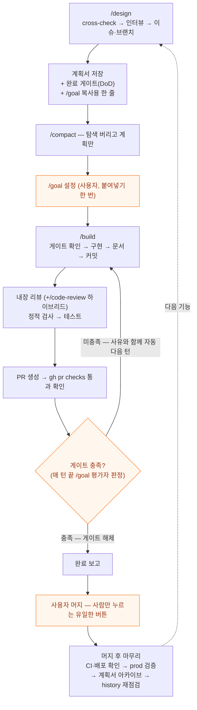

# 작업 시스템 전도 — 무엇이 언제 로드되고, 어디서 강제되는가 (2026-07)

> 스킬 실측 감사(→ [skill-audit-2026-07.md](skill-audit-2026-07.md))와 생태계 조사를 거쳐 시스템을 개편한 뒤, 전체 그림을 한 장으로 정리한 지도. 부품 하나하나가 아니라 "기능 하나가 태어나서 배포되기까지 시스템의 어느 층이 언제 개입하는가"를 따라간다.

## 한 장 요약 — 세 개의 삼각형

시스템 전체는 3×3으로 요약된다:

| 축 | 셋 | 뜻 |
|----|----|----|
| **원본과 소비** | repo 원본 · 심링크 · 마켓플레이스 | 스킬·에이전트·훅의 원본은 git repo 한 벌. 내 머신은 심링크로, 외부인은 플러그인 설치로 소비 |
| **로드 시점** | 상주 · 호출 시 · 스폰 시 | 항상 떠 있는 것은 얇게, 가끔 쓰는 것은 그때만 — 컨텍스트 예산 보호 |
| **강제력** | 문장 < 단계 < 훅 | 지시는 조언, 스킬 단계는 절차, 훅은 기계적 차단 |

## 1. 원본은 repo 한 벌 — 소비 경로는 셋

예전엔 스킬이 `~/.claude/`에 버전 관리 없이 흩어져 있었고, 그래서 프로젝트마다 오래된 사본이 생겨 조용히 늙었다 (감사에서 발견된 4월 사본 drift). 지금은:

```
build-with-ai/                          ← git 원본 (이 repo)
├── .claude-plugin/marketplace.json     ← 외부 설치용 카탈로그
├── plugin/
│   ├── .claude-plugin/plugin.json
│   ├── skills/{design,build,init-project,review-code,orchestrate}/
│   ├── agents/{scout,worker,verifier}.md
│   └── hooks/
│       ├── hooks.json                  ← 플러그인 설치자용 훅 등록
│       └── scripts/guard-*.mjs (+회귀 테스트)
└── workflow/                           ← 이 시스템에 대한 글들
```

소비 경로:

1. **내 머신 (매일)**: `~/.claude/skills/design → repo/plugin/skills/design` 심링크. 덕분에 `/design`처럼 **접두사 없는 이름을 유지**하면서 모든 수정이 git에 남는다. 스킬을 고치는 곳은 repo, 커밋도 repo.
2. **외부인**: `/plugin marketplace add hyewon3938/build-with-ai` → `/build-with-ai:design`처럼 네임스페이스 붙은 이름으로 설치. 글로 설명하던 워크플로우가 설치 가능한 실물이 된다.
3. **훅 스크립트**: `~/.claude/settings.json`이 repo 안의 스크립트를 절대 경로로 직접 실행 (심링크 불필요). 플러그인 설치자는 `hooks.json`으로 같은 걸 자동 등록받는다.

> 플러그인 정식 설치를 내 머신에 안 쓰는 이유: 플러그인 스킬은 이름공간이 강제라(`/build-with-ai:design`) 매일 치는 bare 이름이 깨진다. 공식 문서도 "개인용은 standalone, 공유용은 플러그인" 병행을 권장.

## 2. 무엇이 언제 로드되나 — 컨텍스트 예산 지도

| 층 | 로드 시점 | 내용 | 토큰 비용 |
|----|----------|------|----------|
| 전역 정책 | 모든 세션 시작 | `~/.claude/CLAUDE.md`(보안 규칙) + `orchestration.md`(자율 완수·위임 기준) | 상주 — 그래서 얇게 유지 |
| 프로젝트 맥락 | 프로젝트 세션 시작 | 프로젝트 `CLAUDE.md` + 메모리 인덱스(`MEMORY.md`) | 상주 |
| 스킬 | `/design` 등 호출 시 | `SKILL.md` 본문. `references/`·`templates/`는 그 단계에 가서야 | 호출한 턴만 |
| 에이전트 | scout/worker/verifier 스폰 시 | 각자의 시스템 프롬프트, **별도 컨텍스트** | 메인 컨텍스트 0 |
| 훅 | 항상 감시 | Bash 직전 가드 2종, Edit/Write 직후 포맷, commit 직전 스캔 | **컨텍스트 밖 — 토큰 0** |

읽는 법: 위에서 아래로 갈수록 "항상 켜져 있지만 컨텍스트를 안 먹는" 쪽으로 간다. 훅이 제일 아래층인 게 핵심이다 — 감시는 상시인데 비용은 0.

## 3. 강제력 사다리 — 규칙을 어느 층에 둘 것인가

감사의 교훈("owner가 문장으로만 있는 문서는 멈춘다")을 일반화하면 배치 기준이 나온다:

| 층 | 성격 | 배치 기준 | 예 |
|----|------|----------|----|
| 문장 (CLAUDE.md) | 조언 — 모델이 잊을 수 있다 | 판단이 필요한 원칙, 톤, 취향 | "오버엔지니어링 경계" |
| 단계 (스킬 절차) | 절차 — 그 스킬을 탄 세션에선 보장 | 순서가 있는 워크플로우, 산출물 의무 | features.md 갱신 3-4단계 |
| 훅 (settings/scripts) | 기계적 차단 — 세션·모델·기분 무관 | 한 번이라도 어기면 사고인 것 | `git reset --hard` 차단 |

규칙이 반복해서 안 지켜지면 한 층 아래로 내린다. 이번 개편에서 파괴적 git 명령 가드가 문장(전역 CLAUDE.md 체크리스트)에서 훅으로 내려간 것이 그 예다.

단, 훅도 만능이 아니다 — 패턴 기반 가드는 우회형이 존재할 수 있어 회귀 테스트로 계속 조인다(아래 §6). 파이프라인의 최종 안전망은 훅이 아니라 **사람-머지 게이트**다.

## 4. 기능 하나의 일생 — 전 층이 개입하는 순서



단계별로 어느 층이 일하는지:

1. **`/design`** (스킬 층) — 마스터 cross-check가 직전 phase의 기록 누락까지 회수하고, 인터뷰에서 뼈대 결정은 개념 수준 체크포인트로 확인받는다. 대량 탐색은 scout(에이전트 층)에 위임해 메인 컨텍스트를 지킨다. 산출물은 계획서 — 여기에 **완료 게이트(DoD)** 가 들어가고, 마지막 안내가 **`/goal`에 붙여넣을 한 줄**을 준다.
2. **`/compact` → `/goal`** — 탐색 과정을 버려 구현 세션을 가볍게 시작하고, 설계가 만들어 준 조건을 `/goal`로 건다. 이 순간부터 매 턴이 끝날 때마다 작은 평가 모델이 "조건이 충족됐나"를 판정하고, 미충족이면 사유를 붙여 자동으로 다음 턴을 연다 — **"이어서 해줘"를 사람이 반복하지 않는다.**
3. **`/build`** (스킬 층) — 구현하는 내내 훅 층이 배경에서 돈다: 모든 Bash 직전에 secrets·파괴 명령 가드, 모든 Edit 직후에 포맷터, 커밋 직전에 secrets 스캔. 구현이 끝나면 내장 리뷰(대형 PR은 fresh-context `/code-review` 하이브리드) → 정적 검사·테스트 → PR → CI 확인까지가 스킬의 절차다.
4. **완료 보고** — `/goal` 설정 여부와 무관하게 스킬이 게이트를 자기 점검 기준으로 삼는다. 게이트 미충족이면 "완료"라는 단어를 쓸 수 없다.
5. **머지** — 파이프라인 전체에서 유일하게 사람만 누르는 버튼. 무인 자동 머지는 없다.
6. **머지 후 마무리** — 배포·prod 확인, 계획서 아카이브, history 재점검. 감사에서 "세션의 자연 종료 지점(PR 생성) 뒤의 일은 안 일어난다"고 확인된 그 구간을 명시 단계로 끌어온 것.

## 5. /goal 요약 — 세션 목표 게이트

- **설정**: `/goal <조건>` — 설정 즉시 그 조건을 지시문으로 턴이 시작된다. 세션당 1개, 새로 설정하면 교체.
- **평가**: 매 턴 끝, 작은 모델(기본 Haiku)이 대화에 드러난 증거만 보고 yes/no + 사유. no면 사유가 다음 턴의 가이드가 된다. 평가 비용은 무시할 수준.
- **조건 잘 쓰는 법**: ① 측정 가능한 끝 상태(테스트 통과, PR 체크 green) ② 증명 방법(어떤 명령 출력으로 보여줄지) ③ 제약(계획서 밖 파일 변경 없음) — 여기에 ④ 턴 상한("30턴 초과 시 중단 보고")을 항상 붙인다. 평가자는 명령을 직접 실행하지 못하므로 **대화에 증거가 남는 형태**여야 한다.
- **해제**: `/goal clear`. 상태 확인은 인자 없이 `/goal` (경과 턴·토큰·최근 판정 사유).
- **우리 워크플로우에서의 위치**: 조건을 매번 작문하지 않는다 — `/design`이 계획서의 완료 게이트에서 복사용 한 줄을 만들어 주고, 사용자는 붙여넣기만 한다.

## 6. 이번 개편에서 바뀐 것 (2026-07-12)

| 항목 | 이전 | 이후 |
|------|------|------|
| 스킬 원본 | `~/.claude/`에 비버전 관리 | repo 원본 + 심링크 + 마켓플레이스 패키징 |
| 완주 장치 | 사람이 "이어서" 반복 | 계획서 완료 게이트 → `/goal` 자동 재개 + 완료 보고 자기 점검 |
| 파괴적 명령 | 문장 규칙 (체크리스트) | 훅 차단 (reset --hard, force-push, clean -f, vercel env rm — 전부 사고 이력 보유 명령) |
| secrets 가드 | settings 인라인 한 줄짜리 | 버전 관리되는 스크립트 + 회귀 테스트 + 경로 변형 탐지 보강 |
| 스킬 오발동 | 방지 장치 없음 | 부작용 있는 스킬 4종에 `disable-model-invocation` — 사용자가 칠 때만 |
| 리뷰 | 자체 내장 리뷰만 | 내장 유지 + 대형 PR은 fresh-context `/code-review` 하이브리드 |

정정 기록 하나: 개편 전 조사에서 "훅 미사용"이라고 진단했는데, settings 실측 결과 **이미 훅 3개(포맷·commit 스캔·secrets 가드)가 운영 중**이었다. 안 읽고 단정한 오류. 실제 빈 곳은 파괴적 git 명령 카테고리였고, 그래서 신설 가드는 거기에 집중했다. 새 가드가 살아있다는 증명은 등록 직후 저절로 나왔다 — 회귀 테스트 명령 문자열에 든 `git clean -f` 리터럴을 가드가 즉시 차단해서, 훅이 제 작성자를 막는 것으로 가동 확인이 끝났다. 이어 붙인 적대적 검증은 초판 가드에서 우회 11건(개행 분리, `command`/`sudo` 래퍼 접두, `git -C <dir>`, 플래그 후치, 대문자)을 실증했고, 앵커 보강 후 그 우회형 전부가 회귀 스위트(44케이스)에 차단 케이스로 편입됐다 — 가드의 견고성 주장은 정규형 통과가 아니라 우회 시도 생존으로만 한다.

## 메타

이 글이 이 repo에 있는 이유: 부품(스킬·훅·에이전트) 각각의 글은 이미 있지만, 층이 늘어날수록 필요한 건 부품 설명이 아니라 **배선도**다 — 무엇이 언제 로드되고, 어디서 강제되고, 사람은 어디서만 개입하는가. 시스템이 한 번 더 자랄 때 이 지도부터 갱신한다.
