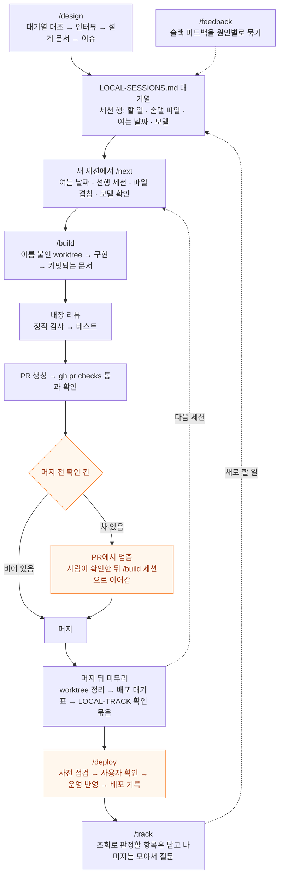

# 작업 시스템 전도 — 무엇이 언제 로드되고, 어디서 강제되는가 (2026-07)

> 스킬 실측 감사(→ [skill-audit-2026-07.md](skill-audit-2026-07.md))와 생태계 조사를 거쳐 시스템을 개편한 뒤, 전체 그림을 한 장으로 정리한 지도. 부품 하나하나가 아니라 "기능 하나가 태어나서 배포되기까지 시스템의 어느 설정이 언제 개입하는가"를 따라간다.

## 한 장 요약 — 세 개의 삼각형

시스템 전체는 3×3으로 요약된다:

| 축 | 셋 | 뜻 |
|----|----|----|
| **원본과 소비** | repo 원본 · 심링크 · 마켓플레이스 | 스킬·에이전트·훅의 원본은 git repo 한 벌. 내 머신은 심링크로, 외부인은 플러그인 설치로 소비 |
| **로드 시점** | 상주 · 호출 시 · 스폰 시 | 항상 떠 있는 것은 얇게, 가끔 쓰는 것은 그때만 — 컨텍스트 예산 보호 |
| **강제력** | 문장 < 단계 < 훅 | 지시는 조언, 스킬 단계는 절차, 훅은 기계적 차단 |

## 1. 원본은 repo 한 벌 — 소비 경로는 셋

예전엔 스킬이 `~/.claude/`에 버전 관리 없이 흩어져 있었고, 그래서 프로젝트마다 오래된 사본이 생겨 조용히 늙었다 (감사에서 발견된 4월 사본 drift). 지금은:

```
build-with-ai/                          ← git 원본 (이 repo)
├── .claude-plugin/marketplace.json     ← 외부 설치용 카탈로그
├── plugin/
│   ├── .claude-plugin/plugin.json
│   ├── skills/{build,deploy,design,feedback,init-project,next,orchestrate,review-code,track,writing}/
│   ├── agents/{scout,worker,verifier}.md
│   ├── scripts/{db-query,env-has}.mjs  ← 운영 DB 조회, 환경 변수 유무 확인
│   └── hooks/
│       ├── hooks.json                  ← 플러그인 설치자용 훅 등록
│       └── scripts/guard-*.mjs (+회귀 테스트)
└── workflow/                           ← 이 시스템에 대한 글들
```

소비 경로:

1. **내 머신 (매일)**: `~/.claude/skills/design → repo/plugin/skills/design` 심링크. 덕분에 `/design`처럼 **접두사 없는 이름을 유지**하면서 모든 수정이 git에 남는다. 스킬을 고치는 곳은 repo, 커밋도 repo.
2. **외부인**: `/plugin marketplace add hyewon3938/build-with-ai` → `/build-with-ai:design`처럼 네임스페이스 붙은 이름으로 설치. 글로 설명하던 워크플로우가 설치 가능한 실물이 된다.
3. **훅 스크립트**: `~/.claude/settings.json`이 repo 안의 스크립트를 절대 경로로 직접 실행 (심링크 불필요). 플러그인 설치자는 `hooks.json`으로 같은 걸 자동 등록받는다.

> 플러그인 정식 설치를 내 머신에 안 쓰는 이유: 플러그인 스킬은 이름공간이 강제라(`/build-with-ai:design`) 매일 치는 bare 이름이 깨진다. 공식 문서도 "개인용은 standalone, 공유용은 플러그인" 병행을 권장.

### 같은 패턴의 확장 — 루틴 프롬프트 (2026-08)

원본을 repo에 두고 소비처는 심링크로 붙이는 구조는 스킬·에이전트·훅 전용이 아니다. 두 번째 적용처는 Claude 앱의 scheduled task 프롬프트였다. 앱 안에만 있던 프롬프트는 버전 관리도 리뷰도 롤백도 안 됐고, 그래서 코드와 프롬프트가 따로 늙었다 — 리포트 출력 포맷을 코드에서 바꿔도 그 포맷을 설명하는 프롬프트는 앱에서 손으로 고쳐야 했고, 한쪽만 고친 상태가 며칠씩 갔다. 지금은 프로젝트 repo의 `docs/routine-prompts/<task>/SKILL.md`가 원본이고 앱 쪽 경로가 그 파일을 가리킨다. 프롬프트 변경이 코드 변경과 같은 PR·같은 리뷰에 실린다.

한 가지 다른 점: **디렉터리가 아니라 파일 단위 심링크**다. 스킬은 디렉터리째 걸어도 되지만(원본이 그 디렉터리를 단독 소유한다), 앱은 자기 디렉터리에 부가 파일을 만들 수 있어서 통째 치환이 유실 위험이 된다. 판단 기준은 하나 — **원본이 그 디렉터리를 단독 소유하는가**. 아니면 링크 단위를 파일로 내린다.

교체 자체는 되돌릴 수 없으니 순서가 있다: 원본 백업 → 백업이 실물과 바이트 단위로 같은지 확인(shasum) → 심링크 교체 → 소비처에서 실제로 새 내용이 읽히는지 확인. 3번만 하고 4번을 건너뛰면 "링크는 걸렸는데 앱은 캐시된 옛 사본을 읽는" 상태를 못 잡는다.

### 세 번째 적용처 — 글로벌 설정 문서 (2026-08)

전역 `CLAUDE.md`와 `orchestration.md`, `settings.json`도 같은 구조로 옮겼다. 이 셋은 개인 환경 경로와 사적인 맥락이 섞여 있어 public인 이 repo에 둘 수 없어서, 원본은 별도 private repo(`claude-config`)에 두고 `~/.claude/` 쪽을 파일 단위 심링크로 붙였다. 이 문서에서 `~/.claude/CLAUDE.md`나 `~/.claude/settings.json`을 가리키는 대목은 모두 그 private repo의 파일을 읽는 경로다.

settings.json에는 주의가 하나 더 붙는다. Claude Code가 테마·모델 변경, 권한 always allow, 플러그인 토글로 이 파일에 직접 쓰기 때문에 저장 방식에 따라 심링크가 일반 파일로 바뀔 수 있고, 그러면 그 뒤의 변경분이 버전 관리에서 빠진다. 그래서 세션이 시작될 때 링크 상태를 확인하는 훅을 그 private repo에 두고 settings.json의 SessionStart에 걸어 두었다. 끊긴 파일이 있을 때만 알리고, 복구도 같은 스크립트의 `--fix`가 맡는다.

## 2. 무엇이 언제 로드되나 — 컨텍스트 예산 지도

| 종류 | 로드 시점 | 내용 | 토큰 비용 |
|----|----------|------|----------|
| 전역 정책 | 모든 세션 시작 | `~/.claude/CLAUDE.md`(보안 규칙) + `orchestration.md`(자율 완수·위임 기준) | 상주 — 그래서 얇게 유지 |
| 프로젝트 맥락 | 프로젝트 세션 시작 | 프로젝트 `CLAUDE.md` + 메모리 인덱스(`MEMORY.md`) | 상주 |
| 스킬 | `/design` 등 호출 시 | `SKILL.md` 본문. `references/`·`templates/`는 그 단계에 가서야 | 호출한 턴만 |
| 에이전트 | scout/worker/verifier 스폰 시 | 각자의 시스템 프롬프트, **별도 컨텍스트** | 메인 컨텍스트 0 |
| 훅 | 항상 감시 | Bash 직전 가드 3종, Edit/Write 직후 포맷, commit 직전 스캔 | **컨텍스트 밖 — 토큰 0** |

읽는 법: 위에서 아래로 갈수록 "항상 켜져 있지만 컨텍스트를 안 먹는" 쪽으로 간다. 훅이 제일 아래인 게 핵심이다 — 감시는 상시인데 비용은 0.

## 3. 강제력 단계 — 규칙을 어디에 둘 것인가

감사의 교훈("owner가 문장으로만 있는 문서는 멈춘다")을 일반화하면 배치 기준이 나온다:

| 방법 | 성격 | 배치 기준 | 예 |
|----|------|----------|----|
| 문장 (CLAUDE.md) | 조언 — 모델이 잊을 수 있다 | 판단이 필요한 원칙, 톤, 취향 | "오버엔지니어링 경계" |
| 단계 (스킬 절차) | 절차 — 그 스킬을 탄 세션에선 보장 | 순서가 있는 워크플로우, 산출물 의무 | `/build` 4단계의 features.md 갱신 |
| 훅 (settings/scripts) | 기계적 차단 — 세션·모델·기분 무관 | 한 번이라도 어기면 사고인 것 | `git reset --hard` 차단 |

규칙이 반복해서 안 지켜지면 한 단계 아래로 내린다. 이번 개편에서 파괴적 git 명령 가드가 문장(전역 CLAUDE.md 체크리스트)에서 훅으로 내려간 것이 그 예이고, 2026-08-30에 지시서 크기 규칙이 같은 경로로 내려갔다(아래 §7).

단, 훅도 만능이 아니다 — 패턴 기반 가드는 우회형이 존재할 수 있어 회귀 테스트로 계속 조인다(아래 §6). 파이프라인의 최종 안전망은 **사람이 확인하는 지점 두 곳**이다. 머지 전 확인 칸이 찬 세션은 PR까지만 올리고 사람이 본 뒤에 머지하고, `/deploy`는 운영 서버에 명령을 보내기 직전에 사용자 확인을 받는다.

## 4. 기능 하나의 일생 — 설정 전체가 개입하는 순서



단계마다 무엇이 일하는지:

1. **`/design`**: 요청을 대기열과 대조해 이미 있는 일인지, 일부 겹치는지, 새 일인지 정하고, 인터뷰에서 뼈대 결정은 개념과 흐름으로 확인받는다. 대량 탐색은 scout 에이전트에 맡겨 메인 컨텍스트를 지킨다. 설계 문서를 main에 커밋하고 이슈를 만든 뒤, 일을 세션으로 나눠 `LOCAL-SESSIONS.md` 대기열에 행으로 넣고, 구현은 `/build`에 넘긴다.
2. **새 세션에서 `/next`**: 대기열 맨 앞 세션을 고르고 여는 날짜, 선행 세션, 파일 겹침, 모델을 확인한 뒤 `/build`로 넘긴다. 기획은 `/design` 세션이 끝내 두므로, 구현 세션은 대기열 행과 이슈, 설계 문서의 해당 절을 읽고 바로 시작한다. 특정 세션을 열 때는 `/build <세션>`을 바로 쓴다.
3. **`/build`**: 세션 하나는 이슈 1개, 브랜치 1개, PR 1개다. 이름 붙인 worktree에서 구현하고 커밋되는 문서를 같은 브랜치에 넣는다. 구현하는 내내 훅이 뒤에서 동작한다. 모든 Bash 직전에 secrets·파괴 명령 가드, 모든 Edit 직후에 포맷터, 커밋 직전에 secrets 스캔이 돈다. 구현이 끝나면 내장 리뷰, 정적 검사와 테스트, PR, CI 확인까지가 스킬의 절차다. sonnet 세션은 리뷰를 opus 서브에이전트에 맡긴다.
4. **완료 보고와 머지**: CI 결과를 확인한 뒤에만 완료를 보고한다. 행의 머지 전 확인 칸이 차 있으면 PR까지 올리고 멈추고, 사람이 확인을 마치면 같은 세션을 `/build <세션>`으로 이어서 머지한다. 칸이 비어 있으면 `/build`가 CI 통과 뒤 바로 머지한다.
5. **머지 뒤 마무리**: worktree와 브랜치를 지우고, 대기열 행을 배포 대기 표로 옮기고, `LOCAL-TRACK.md`에 배포 뒤 확인 묶음을 만든다. 세션은 PR을 만든 뒤에 멈추기 쉬워서, 감사에서 빠진다고 확인한 머지 뒤의 일을 스킬 단계로 적어 둔다. 완료 보고 끝에는 다음 세션과 여는 날짜를 적는다.
6. **`/deploy`**: 같은 배포 묶음의 세션이 모두 배포 대기 표에 있으면 부른다. 프로젝트 LOCAL 파일의 배포 절대로 사전 점검을 하고, 운영 서버에 명령을 보내기 직전에 사용자 확인을 한 번 받는다. 올린 뒤에는 배포 기록을 남기고 배포 대기 표에서 행을 지운다.
7. **`/track`과 `/feedback`**: `/track`은 확인 묶음의 항목 가운데 db, 로그, 슬랙 조회로 판정할 수 있는 것은 직접 닫고, 대화를 봐야 하는 항목과 기한이 지난 항목은 모아서 한 번에 묻는다. `/feedback`은 슬랙에 달린 피드백을 원인별로 묶어 대기열과 확인 목록에 합친다. 두 스킬에서 나온 새 일은 다시 대기열로 간다.

## 5. 세션 목표 게이트 /goal

`/goal <조건>`은 Claude Code 기능이다. 조건을 걸면 매 턴이 끝날 때 작은 모델이 대화에 드러난 증거로 충족 여부를 판정하고, 충족하지 못했으면 사유를 붙여 다음 턴을 자동으로 연다. 지금 스킬에서 완료 판정은 `/build`가 CI 결과를 확인하는 단계가 하고 세션 사이의 이어짐은 대기열과 `/next`가 맡아서, 이 기능은 쓰지 않는다.

## 6. 이번 개편에서 바뀐 것 (2026-07-12)

| 항목 | 이전 | 이후 |
|------|------|------|
| 스킬 원본 | `~/.claude/`에 비버전 관리 | repo 원본 + 심링크 + 마켓플레이스 패키징 |
| 완주 장치 | 사람이 "이어서" 반복 | 계획서 완료 게이트 → `/goal` 자동 재개 + 완료 보고 자기 점검 |
| 파괴적 명령 | 문장 규칙 (체크리스트) | 훅 차단 (reset --hard, force-push, clean -f, vercel env rm — 전부 사고 이력 보유 명령) |
| secrets 가드 | settings 인라인 한 줄짜리 | 버전 관리되는 스크립트 + 회귀 테스트 + 경로 변형 탐지 보강 |
| 스킬 오발동 | 방지 장치 없음 | 부작용 있는 스킬 4종에 `disable-model-invocation` — 사용자가 칠 때만 |
| 리뷰 | 자체 내장 리뷰만 | 내장 유지 + 대형 PR은 fresh-context `/code-review` 하이브리드 |

지금은 계획서와 `/goal` 대신 `/build`가 CI 결과를 확인한 뒤에만 완료를 보고하고, 다음 세션은 대기열에서 `/next`로 연다.

정정 기록 하나: 개편 전 조사에서 "훅 미사용"이라고 진단했는데, settings 실측 결과 **이미 훅 3개(포맷·commit 스캔·secrets 가드)가 운영 중**이었다. 안 읽고 단정한 오류. 실제로 빠져 있던 것은 파괴적 git 명령 카테고리였고, 그래서 신설 가드는 거기에 집중했다. 새 가드가 살아있다는 증명은 등록 직후 저절로 나왔다 — 회귀 테스트 명령 문자열에 든 `git clean -f` 리터럴을 가드가 즉시 차단해서, 훅이 제 작성자를 막는 것으로 가동 확인이 끝났다. 이어 붙인 적대적 검증은 초판 가드에서 우회 11건(개행 분리, `command`/`sudo` 래퍼 접두, `git -C <dir>`, 플래그 후치, 대문자)을 실증했고, 앵커 보강 후 그 우회형 전부가 회귀 스위트(49케이스)에 차단 케이스로 편입됐다 — 가드의 견고성 주장은 정규형 통과가 아니라 우회 시도 생존으로만 한다. 확인 경로는 `plugin/hooks/scripts/` — 가드 본체(`guard-destructive.mjs`·`guard-secrets.mjs`)와 우회형이 차단 케이스로 박혀 있는 회귀 스위트(`run-guard-tests.mjs`)가 여기 있고, `node plugin/hooks/scripts/run-guard-tests.mjs`로 직접 돌려 확인할 수 있다 (2026-08 기준 전부 통과).

## 7. 세 번째 가드 — 지시서 크기 (2026-08-30)

random-ai-companion의 프로젝트 `CLAUDE.md`가 8일 만에 8,693자에서 52,380자가 됐다. 세션마다 끝낸 작업의 본문을 상태 절에 덧붙인 결과다(08-29 하루에 그 파일만 커밋 34건). 08-29에 한 번 60,947자를 27,559자로 줄였는데 같은 날 다시 약 49,000자로 돌아왔다. 줄이는 일은 사람이 한 번씩 하고 늘리는 일은 세션마다 일어나서, 규칙 문장만으로는 다시 돌아온다.

그래서 §3 기준대로 한 단계 내렸다. `guard-doc-size.mjs`가 `git commit` 직전에 이번 커밋에 실리는 파일을 확인하고, `CLAUDE.md`가 20,000자를 넘으면 커밋을 막으면서 완료 항목은 한 줄로 줄이고 상세는 이슈·PR 본문에 남기라고 알린다. 판정 범위를 이번 커밋에 실리는 파일로 좁힌 이유는 크기가 그 파일을 커밋할 때만 늘어나기 때문이고, 덕분에 관계없는 작업이 지시서 정리에 막히지 않는다. 상한은 프로젝트마다 `.claude/doc-size.json`에 다시 적을 수 있다.

회귀 스위트는 59케이스가 됐다. 새로 붙인 10건은 명령 문자열만으로 판정할 수 없어서 임시 git 저장소를 만들어 확인한다. 스테이지 여부, `-am`처럼 스테이지 없이 추적 파일을 싣는 경우, 설정 파일이 깨졌을 때 기본 상한으로 돌아가는지까지 본다.

## 메타

이 글이 이 repo에 있는 이유: 부품(스킬·훅·에이전트) 각각의 글은 이미 있지만, 설정이 늘어날수록 부품 설명보다 **전체 지도**가 필요해진다 — 무엇이 언제 로드되고, 어디서 강제되고, 사람은 어디서만 개입하는가. 시스템이 한 번 더 자랄 때 이 지도부터 갱신한다.
